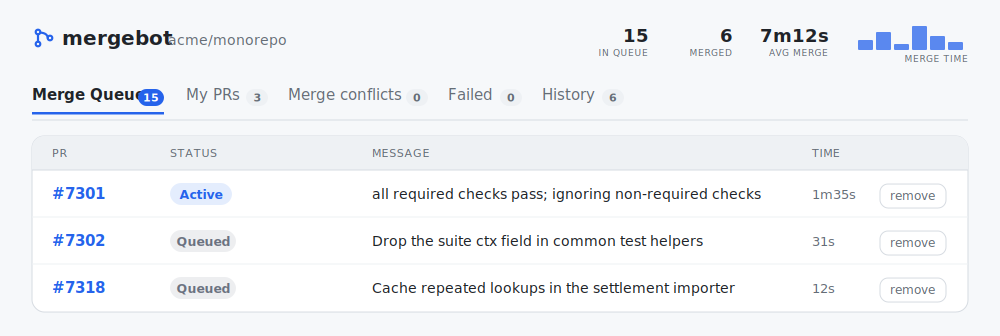
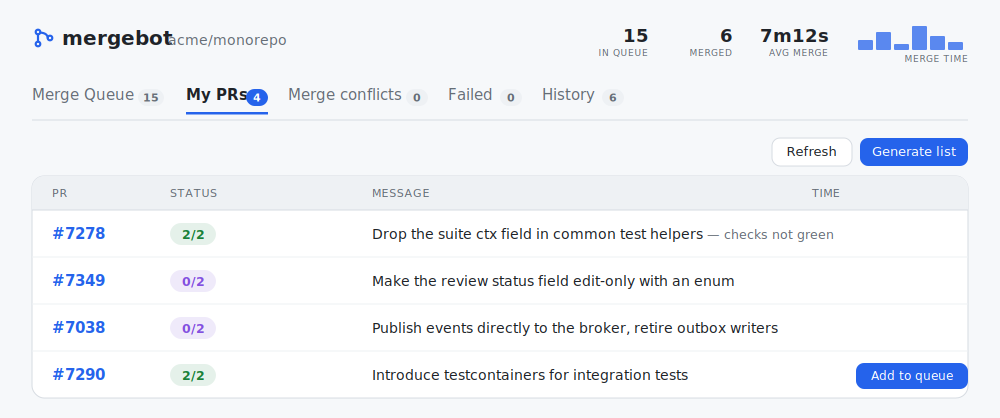
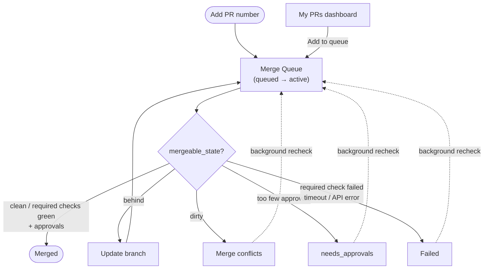

# mergebot

A small tool that takes a pull request number, waits until GitHub reports the PR
is ready, and merges it — automatically running **Update branch** whenever the PR
falls behind its base. It removes the manual "update → wait for CI → merge → it
went stale again" loop that happens when many developers merge into `main`.

It comes in two modes:

- **One-shot CLI** — drive a single PR to merged and exit.
- **Daemon + web UI** — a sequential merge queue you feed PR numbers from the
  browser.

## Screenshots

The merge queue driving PRs to merged, with live stats in the header:



**My PRs** — your open pull requests with approval ratios and one-click
enqueue for the merge-ready ones:



## How readiness is decided

mergebot relies on GitHub's `mergeable_state`, the same signal the green
**Merge** button uses. It already aggregates required approvals, required status
checks, conflicts and branch freshness:

| `mergeable_state` | Action                                                         |
|-------------------|----------------------------------------------------------------|
| `clean`           | merge (squash by default)                                      |
| `behind`          | run **Update branch**, wait for CI to re-run, re-check         |
| `blocked`         | wait, unless it is only under-approved — then park it (`needs_approvals`) |
| `unstable`        | merge once all **required** checks pass; wait while a required check is pending, **decline** if one has failed (force with `--allow-unstable`) |
| `dirty`           | park in **Merge conflicts** (needs a manual rebase); re-checked in the background and re-queued once the conflict is gone |
| `draft` / closed  | stop                                                           |
| `unknown`         | GitHub is still computing; re-check                            |

An already-merged PR is detected and left untouched.

When the state is `unstable`, mergebot reads the base branch's required status
checks (from branch protection) and merges as soon as every **required** check
is green — a failing or still-running **non-required** check no longer blocks the
merge. It keeps waiting while a required check is still pending, but if a required
check has **failed** it stops and declines the PR: in `unstable` the branch is
already up to date with base, so the check will not recover by waiting and the
worker moves on to the next PR. If no required checks are configured, an
`unstable` PR is merged. `--allow-unstable` restores the old behaviour: merge
without inspecting which checks are required.

### Review gate

Before merging, mergebot independently checks (via GraphQL) three things that
GitHub may not enforce through `mergeable_state` unless branch protection is
configured for them:

- **Unresolved review threads** — merge is held while any conversation is open.
- **Review decision** — held on `CHANGES_REQUESTED` or `REVIEW_REQUIRED`.
- **Approval count** — requires at least `--min-approvals` reviewers (default
  **2**) with an approving review as their latest opinionated review. Stale or
  dismissed approvals do not count. Set `--min-approvals=0` to disable. An
  under-approved PR is **not** kept waiting (that would block the worker): it is
  parked (`needs_approvals`) and the worker picks up the next PR. GitHub's own
  `REVIEW_REQUIRED` decision is treated the same way. A slower background loop
  (`--recheck-interval`, default **5m**) re-checks every parked PR and moves any
  that now meet the approval gate back into the queue automatically — no manual
  re-add needed.

The reason is shown in the log and in the queue/History message. The gate is on
by default; pass `--allow-unresolved` (or `MERGEBOT_ALLOW_UNRESOLVED=true`) to
skip it entirely (threads, review decision **and** the approval count).

## Install

```bash
go build -o mergebot .
```

Requires Go 1.26+.

## Authentication

mergebot reads a GitHub token from `GITHUB_TOKEN`. The token owner also defines
whose PRs show up under **My PRs** (override with `--review-author`), so
prefer your own account's token rather than a shared bot account.

### Option A — GitHub CLI (quickest)

If you use the [GitHub CLI](https://cli.github.com/):

```bash
gh auth login          # once, if not already logged in
export GITHUB_TOKEN=$(gh auth token)
```

### Option B — Personal Access Token (PAT)

Create a token in GitHub → **Settings → Developer settings → Personal access
tokens**:

**Classic token** (simplest): *Tokens (classic) → Generate new token (classic)*,
tick the **`repo`** scope, generate, and copy it. That single scope covers
everything mergebot does (read PRs, update-branch, merge, read checks/reviews).

**Fine-grained token** (least privilege): *Fine-grained tokens → Generate new
token*, select the target repository, and grant these **repository permissions**:

| Permission     | Access         | Why                                  |
|----------------|----------------|--------------------------------------|
| Pull requests  | Read and write | read state, merge, update-branch     |
| Contents       | Read and write | update-branch merges base into head  |
| Commit statuses| Read-only      | required-checks gate                 |
| Checks         | Read-only      | required-checks gate                 |
| Metadata       | Read-only      | mandatory                            |

> **Organisation repos with SSO:** after creating a classic token, click
> **Configure SSO** next to it and authorise it for the organisation, or the API
> returns 404s. Fine-grained tokens for org repos may need an org owner to
> approve the request.

Then export it (or use `.env`, below):

```bash
export GITHUB_TOKEN=ghp_xxxxxxxxxxxxxxxxxxxx
```

### Using a `.env` file

Instead of exporting, put the token in a local `.env` (auto-loaded,
git-ignored):

```bash
cp .env.example .env
# then edit: GITHUB_TOKEN=ghp_xxxxxxxxxxxxxxxxxxxx
```

Real environment variables take precedence over `.env`.

The target repository is required — pass `--repo owner/name` or set
`MERGEBOT_REPO=owner/name` (e.g. in `.env`). The examples below assume it is set.

## One-shot mode

```bash
mergebot --repo owner/name 6585           # poll PR #6585 and merge when ready
mergebot --repo owner/name --dry-run 6585 # report what it would do, then exit
mergebot --repo owner/name --interval 20s --timeout 90m 6585
```

## Daemon + web UI

```bash
mergebot serve --repo owner/name                        # http://127.0.0.1:8080
mergebot serve --repo owner/name --addr 127.0.0.1:9000 --state ~/.mergebot.json
```

Open the address in a browser: enter a PR number to enqueue it, watch the queue
status, and remove items. The page polls the API every few seconds. Five tabs:
**Merge Queue** (queued + active), **Merge conflicts** (parked for a manual
rebase), **My PRs** (my open PRs and their approval ratios), **Failed**
(failed or stopped) and **History** (merged only, newest first). The **Time** column
shows the total wall-clock each PR has spent in the queue — live while it is in
flight, frozen once it finishes. Each merged PR also reports it in its message
(`merged in …`), and the History tab shows aggregate stats (count, average,
fastest, slowest time to merge).

The dashboard **triages** each of my open PRs (fetched in parallel — state,
behind-base, checks, approvals) into the right tab:

- **Merge conflicts** — dirty PRs (plus any the queue parked as conflicting).
- **Failed** — a required check failed **and** the branch is up to date, so an
  update can't recover it (plus the queue's own failed/stopped items).
- **My PRs** — the rest of my open PRs: merge-ready ones first (with an
  **Add to queue** button), then the ones still collecting approvals or checks.

Live state wins: only the **Merge Queue** (queued/active) and **History**
(merged) pin a PR to their tab. A stale queue record (failed, stopped, conflict)
hides as soon as the live triage disagrees — a recovered PR moves back to
**My PRs** on the next refresh. **Merge conflicts** and **Failed** are
therefore informational; only **History** has a **Clear All** button. Queue-owned
failed rows keep a **retry** button.

**Auto-recheck:** parked queue items — conflicts, needs-approvals and failed —
are re-checked in the background on `--recheck-interval` and re-queued
automatically once the block clears (a re-run turns green, a conflict is
rebased), with no churn on still-broken ones.

**My PRs** shows each PR's approval ratio (`X/Y` against `--min-approvals`).
A genuinely mergeable one (`mergeable_state` `clean`/`unstable`) gets an **Add to
queue** button; approved-but-not-yet-mergeable ones show a hint (`behind base`,
`checking…`, `needs re-approval`). Under-approved PRs aren't listed here — the
**Generate list** button builds a markdown nudge of them grouped by "approvals
still needed" to paste for reviewers.

The list is built by a background refresh that fetches PRs in parallel; while the
first pass runs the tab shows a loading spinner. Because the queue keeps moving
the base branch (so PRs go stale between refreshes), the tab has a **Refresh**
button that rebuilds it on demand — lower `--recheck-interval` for more frequent
background refreshes.

By default the queue is **sequential** — one PR is driven to merged before the
next starts, matching how a GitHub merge queue behaves. Set `--concurrency` (e.g.
`--concurrency 3`) to drive several PRs in parallel; PRs that fall behind base
while another merges are simply updated on their next poll. The queue is
persisted to the state file, so it survives a restart (in-flight PRs are
re-queued).

### Delegated mode (external merge queue)

If the repository already has a team merge queue driven by a label (a bot that
picks up PRs labelled e.g. `merge-queue`, validates them in batches and merges),
run mergebot with `--merge-mode=label`. Everything else keeps working — the
**My PRs** dashboard, triage into conflicts/failed, **Add to queue**, History and
timing stats — but instead of merging PRs itself, mergebot:

- hands the PR over only once **all its checks are green** (queue bots reject
  red PRs); while checks are still running the item waits as Active, and a
  completed failure declines the handover;
- applies the queue label (`--queue-label`, default `merge-queue`) and watches
  the PR until the external queue merges it;
- watches the PR comments for the bot's feedback: a **"Could not queue PR"**
  reply moves the item to **Failed** with the bot's reason, and the now-stale
  label is removed so a **retry** re-applies it and the bot re-evaluates (queue
  bots don't retry on their own and leave the label behind);
- reports the merge in **History** with the usual `merged in …` timing;
- moves the PR to **Failed** if it is dequeued (label removed) or closed
  unmerged — recovery is manual (**retry**): auto-requeueing is off in this mode
  so mergebot never re-applies a label someone deliberately removed;
- removes the label (best-effort) when you remove the PR from the UI, so the
  external queue drops it too.

There is no per-PR deadline in this mode: batch queues can legitimately hold a
PR for a long time, and the external queue owns the pacing. The UI header shows
`delegating to team queue` so it is obvious which mode is running.

**Rate limits** are handled transparently: the HTTP layer waits out GitHub's
primary (`X-RateLimit-Reset`) and secondary (`Retry-After`) limits and retries,
up to a bounded wait. If a limit would take longer than that bound, the error is
treated as transient — the affected PR stays in place and is re-checked on the
next poll instead of being failed. Raising `--concurrency` increases request
volume, so increase `--interval` if you hit limits often.

The UI is served on `127.0.0.1` only and has no authentication; run it locally.

### HTTP API

| Method | Path                            | Body              | Purpose                          |
|--------|---------------------------------|-------------------|----------------------------------|
| GET    | `/api/items`                    | —                 | list the queue                   |
| GET    | `/api/ready`                    | —                 | my open PRs awaiting approvals   |
| POST   | `/api/ready/refresh`            | —                 | rebuild the My PRs dashboard now |
| POST   | `/api/items`                    | `{"number": 123}` | enqueue (or re-queue / retry) a PR |
| DELETE | `/api/items/{number}`           | —                 | stop / remove a PR               |
| POST   | `/api/items/{number}/requeue`   | —                 | re-check a parked PR now         |
| DELETE | `/api/items?phase=merged,stopped` | —               | clear finished PRs in those phases |
| GET    | `/api/config`                   | —                 | repo shown in UI                 |

## Configuration

Every flag has an environment-variable fallback. Precedence:
**CLI flag → environment variable → `.env` → default**.

| Flag              | Env var                   | Default               | Notes                         |
|-------------------|---------------------------|-----------------------|-------------------------------|
| `--repo`          | `MERGEBOT_REPO`           | — (required)          | `owner/name`                  |
| `--interval`      | `MERGEBOT_INTERVAL`       | `30s`                 | re-check frequency            |
| `--timeout`       | `MERGEBOT_TIMEOUT`        | `60m`                 | give up on a PR after this    |
| `--merge-method`  | `MERGEBOT_MERGE_METHOD`   | `squash`              | `squash`, `merge` or `rebase` |
| `--min-approvals` | `MERGEBOT_MIN_APPROVALS`  | `2`                   | required approving reviews; `0` disables the check |
| `--rate-limit-wait` | `MERGEBOT_RATE_LIMIT_WAIT` | `15m`             | max wait for a rate limit before treating it as transient; `0` disables waiting |
| `--rate-limit-retries` | `MERGEBOT_RATE_LIMIT_RETRIES` | `3`          | max retries while waiting out a rate limit |
| `--allow-unstable`| `MERGEBOT_ALLOW_UNSTABLE` | `false`               | merge an `unstable` PR without checking which checks are required |
| `--allow-unresolved`| `MERGEBOT_ALLOW_UNRESOLVED` | `false`           | merge despite unresolved threads / requested changes |
| `--dry-run`       | `MERGEBOT_DRY_RUN`        | `false`               | one-shot mode only            |
| `--addr`          | `MERGEBOT_ADDR`           | `127.0.0.1:8080`      | `serve` only                  |
| `--state`         | `MERGEBOT_STATE`          | `mergebot-queue.json` | `serve` only                  |
| `--recheck-interval` | `MERGEBOT_RECHECK_INTERVAL` | `5m`             | `serve` only; re-check parked PRs; `0` disables |
| `--concurrency`   | `MERGEBOT_CONCURRENCY`    | `1`                   | `serve` only; PRs driven in parallel |
| `--review-author` | `MERGEBOT_REVIEW_AUTHOR`  | token owner           | `serve` only; GitHub login for the My PRs dashboard |
| `--merge-mode`    | `MERGEBOT_MERGE_MODE`     | `self`                | `serve` only; `self` merges directly, `label` delegates to an external queue |
| `--queue-label`   | `MERGEBOT_QUEUE_LABEL`    | `merge-queue`         | `serve` only; label that triggers the external queue |

## Releasing

Pushing a tag that starts with `v` triggers the
[`release`](.github/workflows/release.yml) workflow, which builds a macOS arm64
binary (with the tag baked into `mergebot --version`) and publishes a **draft**
GitHub Release with a `mergebot_<tag>_darwin_arm64.tar.gz` archive containing the
binary, `.env.example` and this README. Review the draft and publish it manually.

```bash
git tag v1.0.0
git push origin v1.0.0
```

## Flow



`conflicts`, `needs_approvals` and `failed` are all re-checked in the background
and return to `queued` automatically once the block clears (conflict rebased,
approvals arrive, or the failing check recovers); **retry** forces it immediately.
Removing a PR or shutting down leaves it `stopped`.
